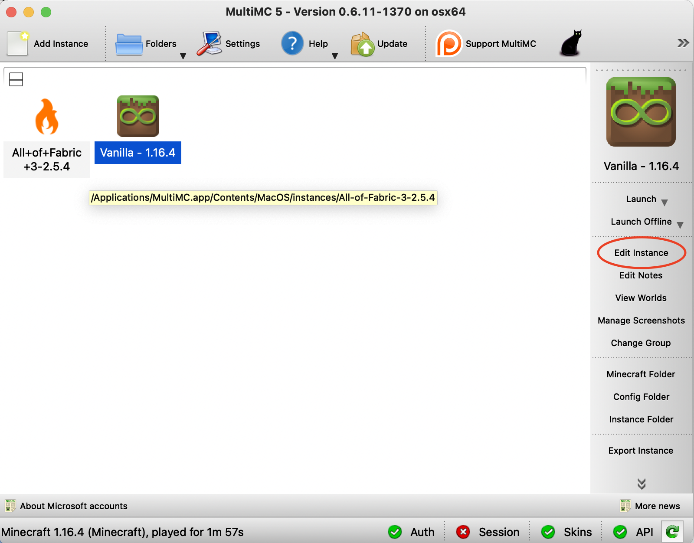
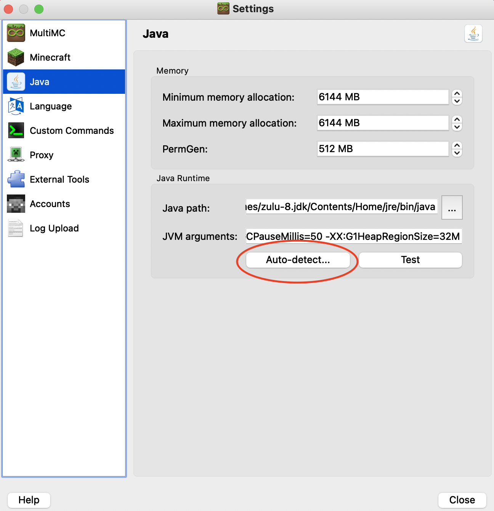
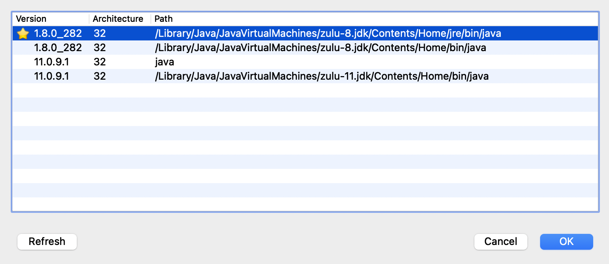

# m1-multimc-hack

Want to get Minecraft running natively on a Mac with an M1 "Apple Silicon" chip? Thanks to [the excellent work](https://gist.github.com/tanmayb123/d55b16c493326945385e815453de411a) by [Tanmay Bakshi](https://gist.github.com/tanmayb123), it's possible!

This repo contains a wrapper script to be used with [MultiMC](https://multimc.org) that will configure any MultiMC instance to use the Apple Silicon native libraries from Tanmay's work. All you have to do is set the wrapper command and make sure you're using an M1-compatible JDK, and it should just work.

## Setup and Usage

### Pre-requisites

First, install the [Zulu Java 11 JDK for macOS ARM64](https://cdn.azul.com/zulu/bin/zulu11.43.1015-ca-jdk11.0.9.1-macos_aarch64.dmg).

You'll also need a standard install of MultiMC.

### Clone or Download this repo

Open a terminal (it's in the `Utilities` folder inside of `Applications`, if you're new to command line stuff).

To make it easy to follow along, we'll make a new directory called `Minecraft` in our home folder. If you'd rather put this repo somewhere else, that's fine - the location doesn't really matter. If you do put it somewhere else, remember to change the references to it in the commands below.

The lines beginning with `#` below are comments and don't need to be entered, but it's fine to copy paste them in along with the rest.

```shell
# Make a place to put our wrapper script and libraries
mkdir -p ~/Minecraft

# enter the new directory
cd ~/Minecraft

# clone this repo
git clone https://github.com/yusefnapora/m1-multimc-hack.git
```

### Deal with Gatekeeper

At some point you might get an error message popping up saying that some `.dylib` file or other wasn't
signed and Apple can't prove that it's not malware. This happens whenever you try to run a binary file which isn't code-signed. I'm not 100% sure if this happens when you clone this repo via git, so this may be a non-issue. If it does happen, here's what to do.

While you can tediously go through each library in the Finder, right click on them and "Open" them, this is super annoying. 

Instead, you can strip the "quarantine bit" from the files using the command line:

```shell
# this assumes you put things in ~/Minecraft as described above; if not, cd there instead
cd ~/Minecraft/m1-multimc-hack/lwjglnatives

# loop through each library and strip the quarantine attribute
for f in *.dylib; do                    
  xattr -dr com.apple.quarantine $f
done
```

As an aside, the nerdy angel on my shoulder really wants to warn against installing random pre-compiled libraries that some guy shoved onto the internet. But then I remembered that this is all in service of playing modded Minecraft, where we all happily download random jar files that somebody shoved onto the internet `¯\_(ツ)_/¯`. Anyway, if you're paranoid enough to care, chances are pretty good you can figure out how to compile LWJGL on your own :)

### Configure MultiMC

Create a new Minecraft instance in MultiMC (or duplicate an existing one), then click "Edit Instance" in the sidebar.



Go to Settings, then make sure the "Java Installation" checkbox is checked. Then hit "Auto-detect".



It should open a window with a list of Java versions. Find the one that says "zulu-11" and select it, then hit OK.



Still in the Settings pane, switch to the "Custom Commands" tab. Check the "Custom Commands" checkbox. In the "Wrapper Command" box, enter the full path to the `mcwrap.py` script from this repo, e.g. `/Users/your-username/stuff/m1-multimc-hack/mcwrap.py`.


An easy way to get the full path (assuming you put this repo in `~/Minecraft`) is to open a terminal and enter:

```shell
ls ~/Minecraft/m1-multimc-hack/mcwrap.py | pbcopy
```

This will expand the `~` character to the full path to your home directory (e.g. `/Users/yourname`), and put the path into your clipboard. Now you can paste it into the "Wrapper Command" box.

That's it! You should be able to launch the instance and run with native performance.

### Optional - Mods

Fabric seems to work great, so that's pretty cool :) To install Fabric, go to the Version pane of the "Edit Instance" screen, then just hit "Install Fabric". You can then add Fabric mods from the "Loader Mods" pane.

So far, I haven't had any luck running Forge - I keep hitting LWJGL bugs that crash on launch. Hopefully this will eventually get sorted out, as it seems to affect most Java JDKs, not just native ARM builds. FWIW, if you get Forge crashes on launch using Rosetta, you should try using Amazon's Coretto build of OpenJDK (version 8), which doesn't seem to be affected and can run Forge, optifine, etc.

## Support, etc

No support here, sorry. I set this up as a favor for a friend for Xmas, and I won't actually have an M1 Mac of my own for a few weeks. Also, I've got a new baby and don't really have time to help.

The files `lwjglfat.jar` and all libraries in the `lwjglnatives` folder were compiled by Tanmay from the source available at https://www.lwjgl.org/source and are subject to its [BSD-style license terms](https://github.com/LWJGL/lwjgl3/blob/master/LICENSE.md).

The `mcwrap.py` script was written by me (Yusef Napora), and is public domain. Please feel free to fork and improve, but expect PRs & issues, etc to be routed to the Sirius Cybernetics Corporation, Complaints Division. [Share and Enjoy!](https://hitchhikers.fandom.com/wiki/Share_and_Enjoy). 
