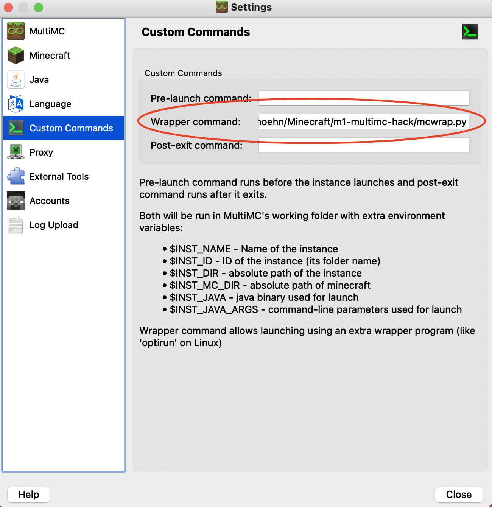

# m1-multimc-hack

NOTE: You will need to visit the "Version" tab in MultiMC for the script to properly detect the version of Minecraft you're running.


OptiFine support is here! Use the new pre6 version for 1.12! (older versions will be updated later)
https://github.com/sp614x/optifine/issues/4824


Want to get Minecraft running natively on a Mac with an M1 "Apple Silicon" chip? Thanks to [the excellent work](https://gist.github.com/tanmayb123/d55b16c493326945385e815453de411a) by [Tanmay Bakshi](https://gist.github.com/tanmayb123), it's possible!

This repo contains a wrapper script to be used with [MultiMC](https://multimc.org) that will configure any MultiMC instance to use the Apple Silicon native libraries from Tanmay's work. All you have to do is set the wrapper command and make sure you're using an M1-compatible JDK, and it should just work. This fork should automatically be compatible with all versions of Minecraft and is compatible with Forge based modpacks as long as you use Java 8 instead of 11.

## Setup and Usage

### Pre-requisites

First, install the [Zulu Java 8 JRE for macOS ARM64](https://cdn.azul.com/zulu/bin/zulu8.52.0.23-ca-jre8.0.282-macosx_aarch64.dmg) for 1.16 and below.
Next, install the  [Zulu Java 16 JRE for macOS ARM64](https://cdn.azul.com/zulu/bin/zulu16.30.19-ca-jdk16.0.1-macosx_aarch64.dmg) for 1.17 and above.

You'll also need a standard install of MultiMC.

### Clone this repo

Open a terminal (it's in the `Utilities` folder inside of `Applications`, if you're new to command line stuff).

To make it easy to follow along, we'll make a new directory called `Minecraft` in our home folder. If you'd rather put this repo somewhere else, that's fine - the location doesn't really matter. If you do put it somewhere else, remember to change the references to it in the commands below.

The lines beginning with `#` below are comments and don't need to be entered, but it's fine to copy paste them in along with the rest.

```shell
# Make a place to put our wrapper script and libraries
mkdir -p ~/Minecraft

# enter the new directory
cd ~/Minecraft

# clone this repo
git clone https://github.com/r58Playz/m1-multimc-hack.git
```

### Configure MultiMC

Go to Settings, then navigate to the Java tab on the right. Then hit "Auto-detect".


It should open a window with a list of Java versions. Find the one that says "zulu-8" in the path and select it, then hit OK. (You may need to resize the window to see the full path.)


Still in the Settings pane, switch to the "Custom Commands" tab. In the "Wrapper Command" box, enter the full path to the `mcwrap.py` script from this repo, e.g. `/Users/your-username/stuff/m1-multimc-hack/mcwrap.py`.



An easy way to get the full path (assuming you put this repo in `~/Minecraft`) is to open a terminal and enter:

```shell
ls ~/Minecraft/m1-multimc-hack/mcwrap.py | pbcopy
```

This will expand the `~` character to the full path to your home directory (e.g. `/Users/yourname`), and copy the whole thing onto your clipboard using the `pbcopy` command. Now you can paste it into the "Wrapper Command" box.

That's it! You should be able to launch the instance and run with native performance.

### 1.17
If you usually play on 1.16 and below, then for each 1.17 and above instance just override the global JVM and select the one that says "zulu-16".

Otherwise just set the global JVM to the one that says "zulu-16" and override each 1.16 and below instance's jvm to the one that says "zulu-8".

## Support, etc

The files `lwjglfat.jar` and all libraries in the `lwjglnatives` folder were compiled by Tanmay from the source available at https://www.lwjgl.org/source and are subject to its [BSD-style license terms](https://github.com/LWJGL/lwjgl3/blob/master/LICENSE.md).

The `mcwrap.py` script was written by Yusef Napora, and is public domain. Please feel free to fork and improve, but expect PRs & issues, etc to be routed to the Sirius Cybernetics Corporation, Complaints Division. [Share and Enjoy!](https://hitchhikers.fandom.com/wiki/Share_and_Enjoy)
